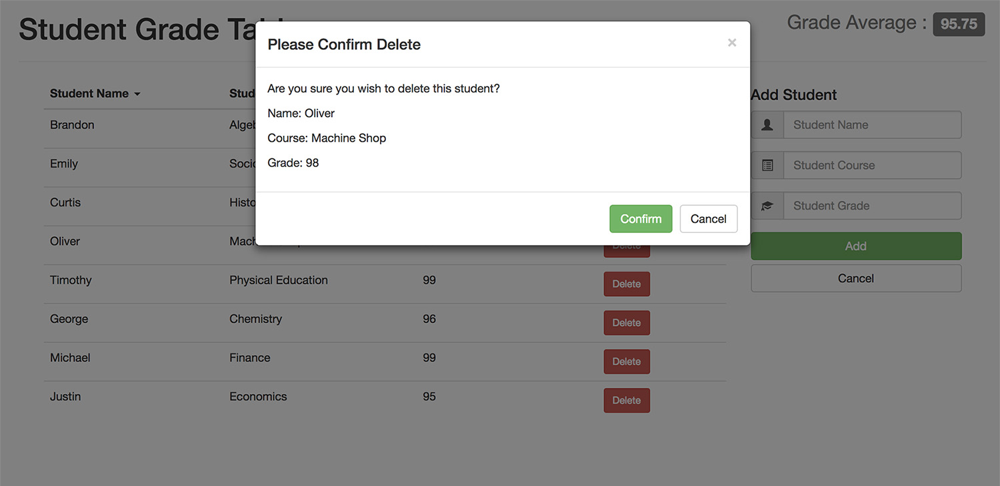

# Student Grade Table

*   Live Link: [Click Here](https://sgt.nickquan.com)

## About Student Grade Table

> Student Grade Table (SGT) is a content management system (CMS) that allows the user to create, read, and delete student data from a MySQL database. SGT utilizes HTML5 to structure the page and Bootstrap for UI/UX and mobile-responsiveness. CSS3 was used to animate the glyphicon. JavaScript and jQuery were used to utilize DOM manipulation and AJAX calls were made to the Node.js server to retrieve data. SGT also utilizes a PHP script cron job to truncate and re-insert the table data every hour.

## Screenshots

## Technologies Used

*   JavaScript
*   jQuery
*   AJAX
*   MySQL
*   Node.js
*   PHP
*   HTML5
*   CSS3
*   Bootstrap

## Tools Used

*   Git
*   GitHub
*   JSDoc
*   MeisterTask
